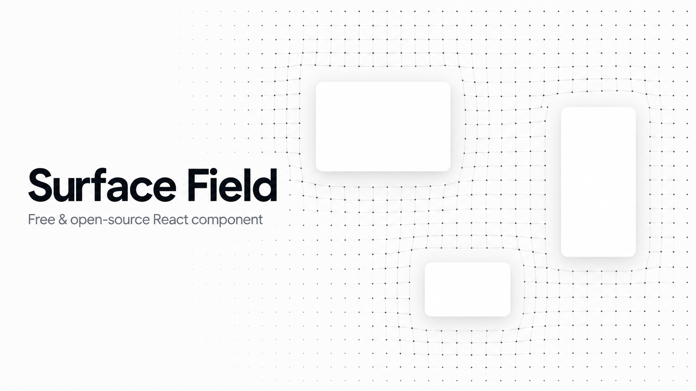

# Surface Field



A responsive React canvas field of dots, connected lines, moving light, and local pointer distortion. It is decorative, theme aware, and has no UI framework dependency.

Try the [interactive demo](https://angelolibero.github.io/surface-field/) with presets, live controls, draggable objects, light and dark themes, and a copyable React configuration.

## Use it

Install from GitHub:

```bash
npm install github:angelolibero/surface-field
```

React 18 or 19 is a peer dependency. Git installation runs the package's `prepare` build, so consumers receive JavaScript and TypeScript declarations without compiling the source themselves.

```tsx
import { SurfaceField } from "surface-field";

export function Backdrop() {
  return <div style={{ position: "relative", minHeight: 500 }}>
    <SurfaceField
      connected
      gap={22}
      focusRadius={600}
      lineRadius={200}
      baseOpacity={0.02}
      maxOpacity={0.2}
      tint={0}
      breathe={0}
      wander={false}
      cursorPush={2}
      ripplePush={6}
      style={{ position: "absolute", inset: 0, color: "var(--foreground)" }}
    />
    <div style={{ position: "relative" }}>Your content</div>
  </div>;
}
```

The parent supplies size and background. The field draws no background and never intercepts pointer input. Its root is `aria-hidden`. The pointer light follows the cursor; a press creates a ripple. It pauses while the document is hidden and renders a still frame for reduced motion.

## Interactive surfaces

An editor can send object rectangles directly to one field instance. Scene rectangles use CSS pixels relative to a root element's border box. Gesture footprints and previews use viewport CSS rectangles. The example assumes an existing `workspaceRef` and `workspaceElement` in the host editor; the copied demo configuration is a backdrop component and does not automatically discover DOM objects.

```tsx
import { SurfaceField, createSurfaceFieldController } from "surface-field";

const controller = createSurfaceFieldController();

<SurfaceField controller={controller} interactionRoot={workspaceRef} />;

controller.setScene({
  root: workspaceElement,
  rects: [{ id: "item-1", parent: null, left: 12, top: 20, right: 112, bottom: 90 }],
});
```

Create one controller per mounted field. Keep its identity stable across renders, for example with `useMemo(createSurfaceFieldController, [])`. The controller updates geometry without a React render. See the [API](docs/API.md), [architecture](docs/ARCHITECTURE.md), and [integration guide](docs/INTEGRATION.md).

## Develop

```bash
npm ci
npm run typecheck
npm test
npm run build
cd demo && npm ci && npm run dev
```

The demo is a separate Vite app. Its shadcn/ui controls live only in `demo/`; the library runtime imports React and its own modules only. `npm run demo:build` builds both package and demo. `npm pack` includes the built library and docs, not the demo app.

## License

MIT. See [LICENSE](LICENSE). Made by [Angelo Libero](https://github.com/angelolibero).
